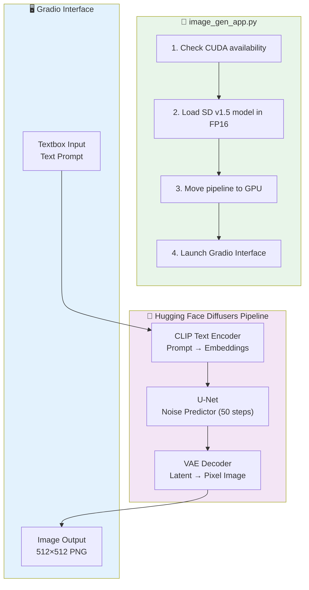
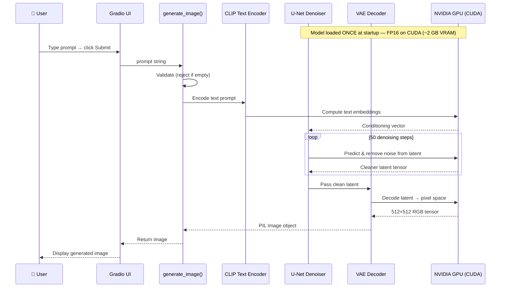

# 🎨 AI Image Generator with Stable Diffusion

[](https://python.org)
[](https://gradio.app)
[](https://developer.nvidia.com/cuda-toolkit)
[](https://huggingface.co/runwayml/stable-diffusion-v1-5)
[](LICENSE)

A GPU-accelerated **text-to-image generation** web app powered by **Stable Diffusion v1.5** and a **Gradio** interface. Enter any creative text prompt and watch the AI generate a stunning image in seconds — optimized for NVIDIA RTX GPUs.

---

## How It Works

```mermaid
flowchart LR
    A([👤 User]) -->|Types text prompt| B["Gradio Web UI\nlocalhost:7860"]
    B -->|Sends prompt string| C["generate_image()\nfunction"]
    C -->|Validates & runs| D["StableDiffusionPipeline\nrunwayml/stable-diffusion-v1-5\nFP16 precision"]
    D -->|GPU inference| E[("NVIDIA GPU\nCUDA")]
    E -->|PIL Image result| D
    D -->|result.images[0]| C
    C -->|Returns image| B
    B -->|Displays result| A

    style A fill:#4CAF50,color:#fff
    style E fill:#76b900,color:#fff
    style D fill:#8e44ad,color:#fff
```

---

## Architecture



---

## Stable Diffusion — Internal Step-by-Step



---

## Project Structure

```
Image-Generator-with-stable-diffusion/
├── image_gen_app.py       # Entry point — model loading + Gradio UI
└── requirements.txt       # torch, diffusers, transformers, accelerate, gradio
```

### Tech Stack

| Component | Technology |
|-----------|-----------|
| Generative Model | Stable Diffusion v1.5 (`runwayml/stable-diffusion-v1-5`) |
| ML Framework | PyTorch with CUDA + FP16 |
| Diffusion Pipeline | Hugging Face `diffusers` |
| Web UI | Gradio |
| Accelerator | NVIDIA CUDA (RTX 2060+) |

---

## Requirements

- Python **3.9+**
- NVIDIA GPU with **CUDA support** (RTX 2060 or better recommended)
- **4 GB+ VRAM** minimum
- **8 GB+ RAM**

---

## Setup & Installation

### 1. Clone the repository

```bash
git clone https://github.com/MayankSinghRaghav/Image-Generator-with-stable-diffusion.git
cd Image-Generator-with-stable-diffusion
```

### 2. (Recommended) Create a virtual environment

```bash
python -m venv venv

# Windows
venv\Scripts\activate

# Linux / macOS
source venv/bin/activate
```

### 3. Install PyTorch with CUDA support

```bash
pip install torch torchvision torchaudio --index-url https://download.pytorch.org/whl/cu118
```

### 4. Install remaining dependencies

```bash
pip install -r requirements.txt
```

### 5. Launch the app

```bash
python image_gen_app.py
```

Open your browser at **`http://127.0.0.1:7860`**

> **First Run:** The Stable Diffusion v1.5 weights (~4 GB) are downloaded automatically from Hugging Face and cached locally. All subsequent launches are instant.

---

## Example Prompts

| Prompt | Style |
|--------|-------|
| `"An astronaut riding a horse in a futuristic city"` | Sci-fi |
| `"Cyberpunk dragon flying over Tokyo at night"` | Fantasy / Cyberpunk |
| `"A fantasy castle in the clouds at sunrise"` | Fantasy |
| `"Impressionist oil painting of a sunflower field"` | Artistic |
| `"Portrait of a samurai warrior, ultra realistic 4K"` | Photorealistic |
| `"A serene Japanese zen garden with cherry blossoms"` | Nature |

---

## GPU Memory Reference

| GPU VRAM | Performance |
|----------|-------------|
| 4 GB | Works with FP16, 512×512 output |
| 6 GB | Comfortable speed, standard output |
| 8 GB+ | Best performance, can run 768×768 |

---

## Troubleshooting

**CUDA not available**
- Ensure your GPU drivers are up to date
- Install the correct PyTorch build for your CUDA version from [pytorch.org](https://pytorch.org)

**Out of memory error**
- Close other GPU-intensive applications
- The model runs in FP16 by default to minimize VRAM usage

**Slow first inference**
- Normal — the first run compiles CUDA kernels; subsequent generations are much faster

---

## License

This project is open-source under the **MIT License**.
